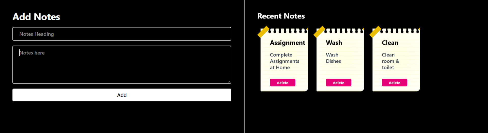

# 📝 Notes UI Project  

A modern and minimal **Notes Taking UI** built using **React + Tailwind CSS**.  
This project focuses on clean layout design, reusable components, and smooth user interaction.  

---

## 🚀 Features  

* ⚛️ Built with React (component-based architecture)  
* 🎯 Styled using Tailwind CSS  
* 📝 Add notes with title and description  
* 🗂️ Display recent notes in card layout  
* ❌ Delete notes functionality  
* 📱 Responsive and clean dark-themed UI  

---

## 📸 Preview  

  

---

## 🛠️ Tech Stack  

* React.js  
* Tailwind CSS  
* JavaScript (ES6+)  
* HTML5  

---

## 🎯 What I Learned  

* Using Tailwind CSS for rapid UI development  
* Managing state using React (`useState`)  
* Creating reusable components (Note Card, Form)  
* Handling user input and events  
* Structuring responsive layouts with Flexbox & Tailwind  

---

## 📌 Future Improvements  

* 💾 Add Local Storage (save notes permanently)  
* ✏️ Edit notes feature  
* 🔍 Search and filter notes  
* 🎨 Add animations (Framer Motion)  
* 🌙 Light/Dark mode toggle  

---

## 🙋‍♂️ Author  

**Krishna**  
CSE Engineering Student | MERN Stack Learner  

---

## ⭐ Support  

If you like this project, give it a ⭐ on GitHub!  
